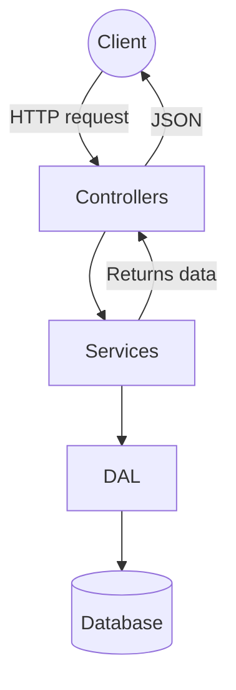

# Project Flow

The diagram below summarizes how requests are processed in the Task Manager API.

Each layer has a specific responsibility:

- **Controllers** handle HTTP requests and responses.
- **Services** contain business logic.
- **DAL (Data Access Layer)** interacts with the database via Entity Framework Core.
- **Database** stores tasks, categories, and users.

Use this diagram to explain the flow of information through the application.
